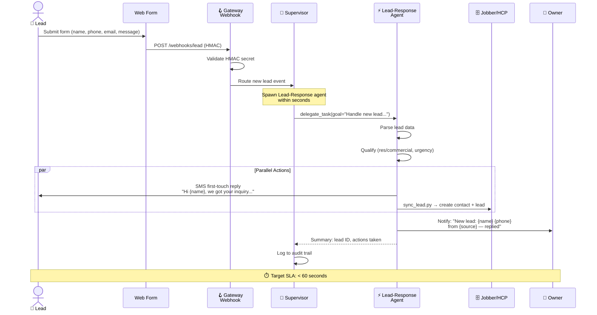
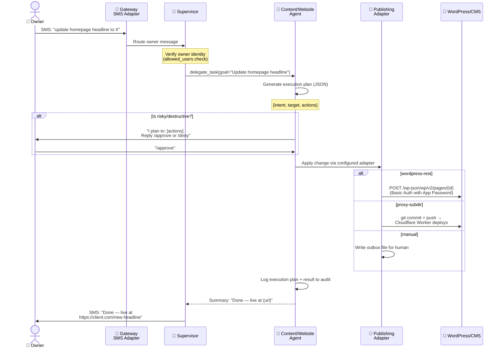
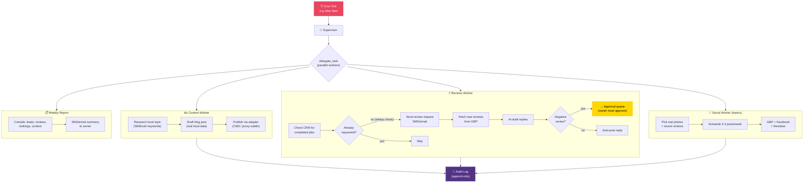
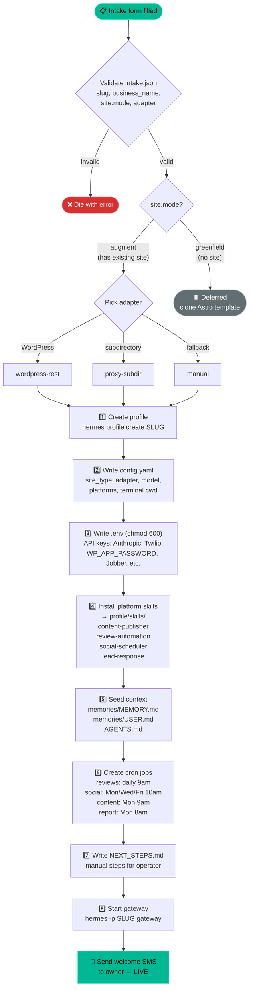
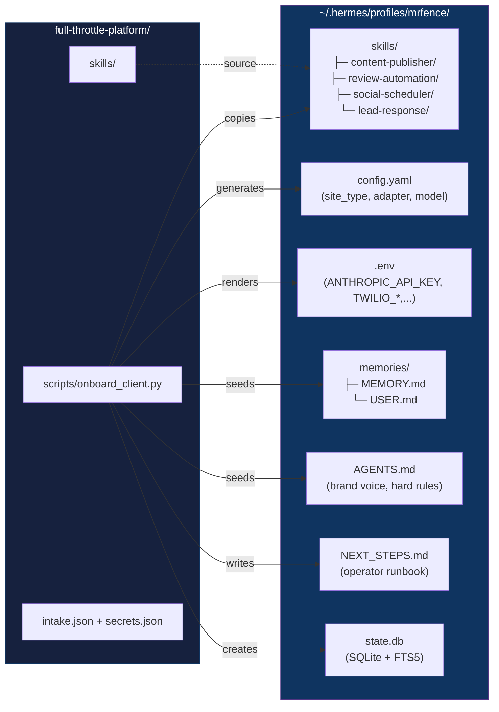
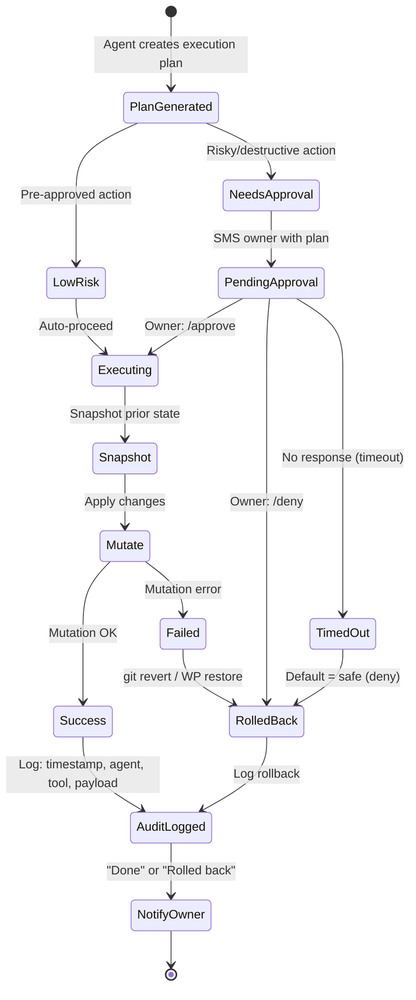
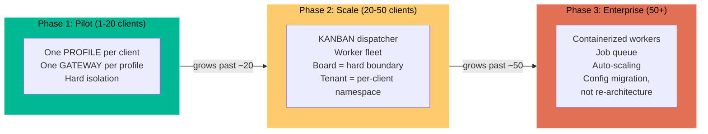

# Full Throttle Platform — Architecture Diagrams (Mermaid)

## 1. System Architecture (Deployment View)

```mermaid
graph TB
    subgraph Internet["🌐 Internet"]
        Owner["📱 Owner (SMS/Email)"]
        Lead["👤 Lead (Web Form / Call / LSA)"]
        GBP["📊 Google Business Profile"]
        CRM["🗄️ Jobber / HCP CRM"]
        CMS["📝 WordPress / Wix CMS"]
    end

    subgraph DO["🖥️ DigitalOcean Droplet"]
        subgraph Gateway["🚪 Hermes Gateway (per-client profile)"]
            SMSAdapter["📨 SMS Adapter<br/>(Twilio)"]
            WebhookAdptr["🪝 Webhook Adapter<br/>(api_server)"]
            CronSched["⏰ Cron Scheduler"]
        end

        subgraph Supervisor["🧠 Supervisor Agent"]
            Router["↗️ Task Router"]
            Policy["🛡️ Policy Engine"]
            Approvals["✅ Approval Queue"]
            Reporter["📋 Weekly Reporter"]
        end

        subgraph Workers["👷 Worker Agents (delegate_task)"]
            LeadAgent["⚡ Lead-Response<br/>Agent"]
            RepAgent["⭐ Reputation<br/>Agent"]
            GBPAgent["🏢 GBP<br/>Agent"]
            ContentAgent["✍️ Content<br/>Agent"]
        end

        subgraph State["💾 Per-Profile State"]
            Config["config.yaml"]
            DotEnv[".env (secrets)"]
            Memories["memories/<br/>MEMORY.md, USER.md"]
            StateDB["state.db<br/>(SQLite+FTS5)"]
            AuditLog["audit.log<br/>(append-only)"]
        end
    end

    Owner -->|"SMS: 'update headline...'"| SMSAdapter
    Lead -->|"POST /webhooks/lead"| WebhookAdptr
    CronSched -->|"9am Mon/Wed/Fri"| Supervisor

    SMSAdapter --> Supervisor
    WebhookAdptr --> Supervisor
    CronSched --> Supervisor

    Supervisor --> Router
    Router -->|"delegate_task"| LeadAgent
    Router -->|"delegate_task"| RepAgent
    Router -->|"delegate_task"| GBPAgent
    Router -->|"delegate_task"| ContentAgent

    LeadAgent -->|"sync lead"| CRM
    LeadAgent -->|"first-touch reply"| Owner
    LeadAgent -->|"notify"| Owner
    LeadAgent --> AuditLog

    RepAgent -->|"request review"| Owner
    RepAgent -->|"draft reply"| GBP
    RepAgent --> Approvals
    RepAgent --> AuditLog

    GBPAgent -->|"post / Q&A"| GBP
    GBPAgent --> AuditLog

    ContentAgent -->|"publish blog post"| CMS
    ContentAgent --> Approvals
    ContentAgent --> AuditLog

    Supervisor --> Reporter
    Reporter -->|"weekly summary"| Owner

    Router -.-> Config
    Router -.-> DotEnv
    Router -.-> Memories
    Router -.-> StateDB

    style DO fill:#1a1a2e,stroke:#e94560,color:#fff
    style Gateway fill:#16213e,stroke:#0f3460,color:#fff
    style Supervisor fill:#16213e,stroke:#0f3460,color:#fff
    style Workers fill:#16213e,stroke:#0f3460,color:#fff
    style State fill:#0f3460,stroke:#533483,color:#fff
```

## 2. Inbound Lead Flow (Flow A — Top Revenue Lever)

## 3. Owner Command Flow (Flow B — Human Override)

## 4. Autonomous Cadence Flow (Flow C — Cron-Driven)

## 5. Client Onboarding Flow (Flow E — intake → live)

## 6. Onboarding Script Profile Tree

## 7. Approval & Governance State Machine

## 8. Scaling Path (Profiles → Kanban)

